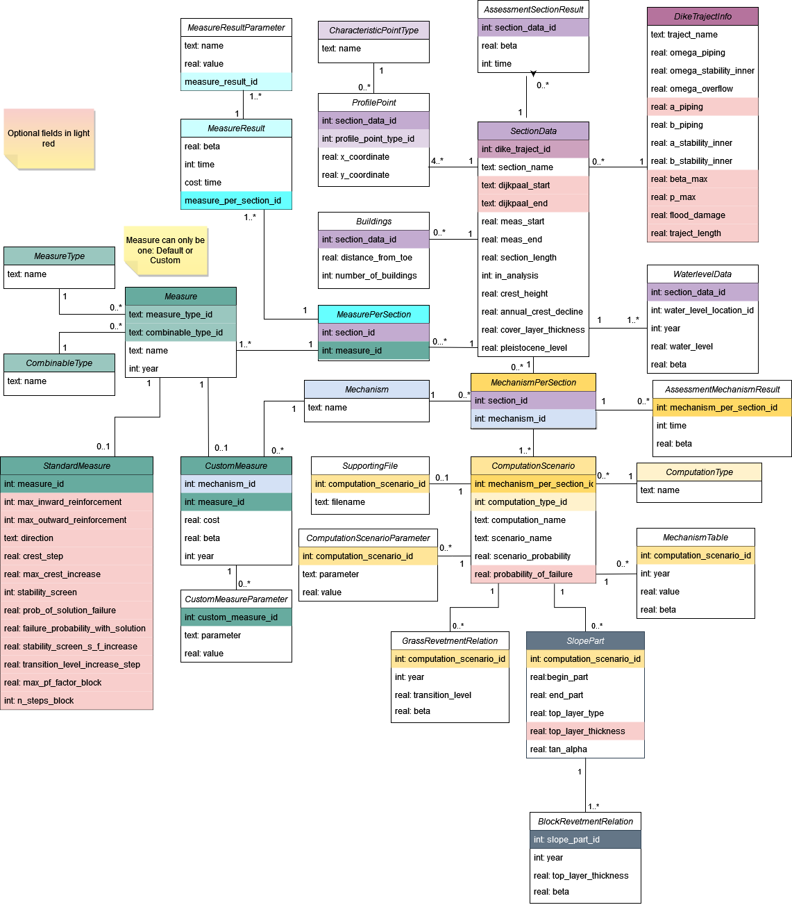

# Object Relational Mapping (ORM)

This module focuses on mapping the input/output database tables (in SQLite) to an object representation within the `vrtool`.

## Module structure.

* Importers: The classes responsible to read one or many tables from a database and trigger the corresponding mappings to `vrtool` objects. They are located in the `vrtool.orm.importers` module.
* Exporters: The classes responsible to write in one or many tables of a database with the current status of our `vrtool` objects. They are located in the `vrtool.orm.exporters` module.
* Models: `Python` objects representing the database entities and their relationships. They are located in the `vrtool.orm.models` module.
* Controllers: A series of endpoints to trigger different actions related to read or write from / to the database. For now located in the `vrtool.orm.orm_controllers.py` file.
* `orm_db.py`. File containing the simple definition of the current (`SQLite` database).

## How to use it?

This module is meant to be used locally. However, it is technically possible to generate a database when using the tool as a sandbox. A simple example can be shown below:

```python
from vrtool.orm.orm_controllers import initialize_database
from pathlib import Path

_my_database_location = Path("C:\\my_repo\\my_database.db")
initialize_database(_my_database_location)
```

It is also possible to load an existing database:

```python
from vrtool.orm.orm_controllers import open_database
from pathlib import Path

_my_database_location = Path("C:\\my_repo\\my_database.db")
open_database(_my_database_location)
```

## Database integration.

To achieve a correct integration with/from the database, we will be using the `peewee` library, which is MIT licensed. You may find more about it in the [peewee GitHub repo](https://github.com/coleifer/peewee).

We make the mappings based on the documentation's diagram:



We know that some of the properties represented as `int` are actually `booleans`. This will be represented in the python classes. For the rest, we will follow a natural translation:

| SQLite Type | ORM Type | Python Type | Remarks |
| --- | --- | --- | --- |
| text | CharField | str | Max 128 characters|
| text | TextField | str | For large pieces of text (>128 characters)|
| int / integer | IntegerField | int | |
| int / integer | BooleanField | bool | Only on given occassions. |
| real | FloatField | float | |

## Versioning.

To ensure proper operation of `vrtool` when importing/exporting objects from/to the database, a specific version of the `orm` is given a version number (e.g. '1.2.3') according to semantic versioning. This version is updated on any change of the `orm` and unrelated to the versioning of `vrtool`.
In the context of the `orm`:
* a major release has functional impact and is NOT backwards compatible (e.g. adding a table that contains required data for a `vrtool` analysis)
* a minor release has functional impact and is backwards compatible (e.g. adding a column with a default value)
* a patch release has no functional impact and is backwards compatible (e.g. tweaking a database or table property)

### Version update.
TODO:
* how to update the version
* create/run a conversion script adding the version to the database

### Compatibility check.
On starting the `vrtool` with a database to import/export data from/to the version of the database is checked against the version or the `orm`.
In case the version of the database is not compatible with the `orm`, operation is terminated with an error. The user is responsible for creating databases that are compatible. A provided conversion script with instruction can support this process.
If the database is compatible, a warning or info message is issued if the minor or patch version is different, respectively. The user is encouraged to migrate the database to the current version of the `orm` with a provided conversion script.
Migration scripts are located in `scripts\migration\versions`.

### Database migration.
TODO:
* how to update the database

### Future developments.
In the future a database will be automatically migrated to the version of the `orm` on startup of the `vrtool`, assuming the database is compatible.
In case the database is not compatible, a migration can be done partially, leaving the rest to the user.
