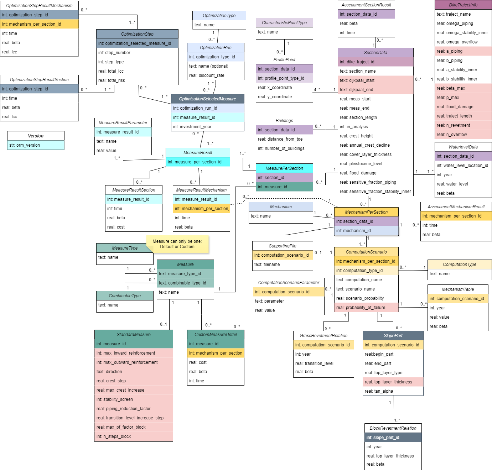

# Object Relational Mapping

This module focuses on mapping the input database tables (in SQLite) to an object representation within the `vrtool`.

## Module structure.

* Readers: The classes responsible to read one or many tables from a database and trigger the corresponding mappings to `vrtool` objects.
* Writers: The classes responsible to write in one or many tables of a database with the current status of our `vrtool` objects.
* Classes: `Python` objects representing the database entities and their relationships.

## Database integration.
To achieve a correct integration with / from the database, we will be using the `peewee` library, which is MIT licensed. You may find more about it in the [peewee GitHub repo](https://github.com/coleifer/peewee).

We make the mappings based on the documentation's diagram:

We know that some of the properties represented as `int` are actually `booleans`, this will be represented in the python classes. For the rest, we will follow a natural translation:

| SQLite Type | ORM Type | Python Type | Remarks |
| --- | --- | --- | --- |
| text | CharField | str | Max 128 characters|
| text | TextField | str | For large pieces of text (>128 characters)|
| int / integer | IntegerField | int | |
| int / integer | BooleanField | bool | Only on given occassions. |
| real | FloatField | float | |
| blob | BlobField | To be determined | We are not sure yet whether this is applicable |
